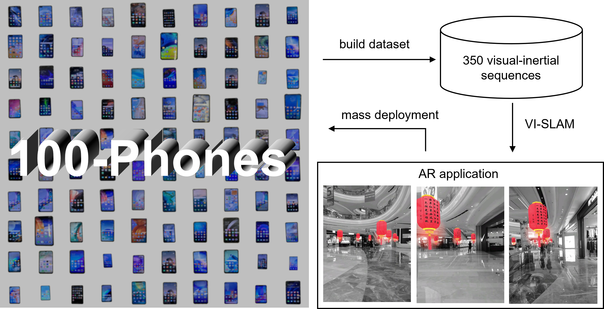
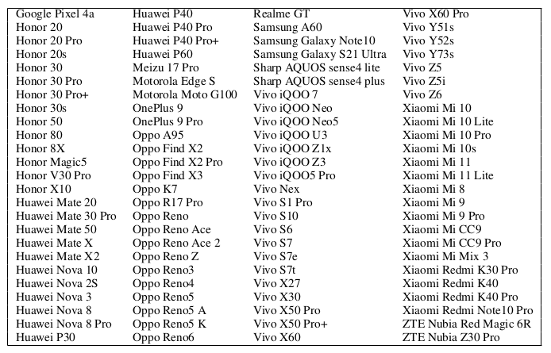

# 100-Phones: A Large VI-SLAM Dataset for Augmented Reality Towards Mass Deployment on Mobile Phones

Visual-inertial SLAM (VI-SLAM) is a key technology for Augmented Reality (AR), which allows the AR device to recover its 6-DoF motion in real-time in order to render the virtual content with the corresponding pose. Nowadays, smartphones are still the mainstream devices for ordinary users to experience AR. However the current VI-SLAM methods, although performing well on high-end phones, still face robustness challenges when deployed on a larger stock of mid- and low-end phones. Existing VI-SLAM datasets use either very ideal sensors or only a limited number of devices for data collection, which cannot reflect the capability gaps that VI-SLAM methods need to solve when deployed on a large variety of phone models. This work proposes 100-Phones. the first VI-SLAM dataset covering a wide range of mainstream phones in the market. The dataset consists of 350 sequences collected by 100 different models of phones. Through analysis and experiments on the collected data, we conclude that the quality of visual-inertial data vary greatly among the mainstream phones, and the current open source VI-SLAM methods still have serious robustness issues when it comes to mass deployment on mobile phones. We release the dataset to facilitate the robustness improvement of VI-SLAM and to promote the mass popularization of AR.  


# Video

For the details, you can refer to the videos.

https://www.youtube.com/watch?v=DURflqYQCkk

https://www.youtube.com/watch?v=NIlEa_M_aeA

# Our Dataset

## List of 100 phone models



## Dataset Format

We design three simple yet typical motions to collect three sub-datasets in a small-scale scene. Each sub-dataset contains 100 sequences collected by the 100 phones. We name the data format as "dior" and organize the three sub-dataset as follow:

### Circle/Line/Rotation 

```shell
eg: train_data/circle/huawei-mate30-pro.tar.xz
|--camera
|   |--images
|     |--6158863991000.jpg
|     |--6158897604000.jpg
|     |--...
|   |--data.csv
|   |--sensor.yaml
|--imu
|   |--data.csv
|   |--sensor.yaml
|--htc
|   |--data.csv
|   |--sensor.yaml
|--groundtruth
|   |--data.csv
|   |--euorc_gt_body.csv
|   |--sensor.yaml

```

We design the fourth sub-dataset in three large-scale scenes. We select five phones, each collects ten sequences, resulting in 50 sequences. For the "general" sub-dataset, we arrange the data according to five different phone models. Every phone model contains ten sequences of different motions. We organize the "general" sub-dataset as follow:

### General 

```shell
eg: train_data/general/huawei-mate30-pro/2022-11-21-11-45-19-465-normal-walk-f1.tar.xz
|--camera
|   |--images
|     |--76204892580000.jpg
|     |--76204926193000.jpg
|     |--...
|   |--data.csv
|   |--sensor.yaml
|--imu
|   |--data.csv
|   |--sensor.yaml
|--groundtruth
|   |--euorc_gt_body.csv

```

### Data description

The detailed data description is as follows:

- camera/data.csv

  ```csv
  t[s:double], filename[string]
  ```

- camera/sensor.yaml

  ```
  type: camera # sensor type
  description: huawei-mate30-pro # phone model
  frequency: 24.0 # [hz]
  camera_model: pinhole
  distortion_model: radtan
  
  # camera intrinsic parameters
  intrinsic:
    camera: [492.450332, 492.037325, 312.015553, 241.927651] # fx fy cx cy
    distortion: [0.053029, -0.075253, -6.6e-05, -0.0031]    # k1 k2 r1 r2
  
  # camera to body transform
  extrinsic:
    q: [-0.705947, 0.708258, 0.00232, 0.002207]  # x y z w
    p: [-0.033561, 0.016211, -0.008582] # [m]
    t: 0.015351  # [s]  time-offset, t_imu = t_cam + shift 
  ```

- imu/data.csv

  ```csv
  t[s:double],w.x[rad/s:double],w.y[rad/s:double],w.z[rad/s:double],a.x[m/s^2:double],a.y[m/s^2:double],a.z[m/s^2:double]
  ```

- imu/sensor.yaml

  ```
  type: imu # sensor type
  description: aquos-sense4-lite # phone model
  frequency: 200.0 # [hz]
  
  # calibrated discrete noise parameters 
  intrinsic:
    sigma_w: 0.009805 # [rad/s/sqrt(hz)], discrete-time gyroscope noise density
    sigma_bw: 9.8e-05 # [rad/s^2/sqrt(hz)], discrete-time gyroscope random walk
    sigma_a: 0.045191 # [m/s^2/sqrt(hz)], discrete-time accelerometer noise density
    sigma_ba: 0.000452 # [m/s^3/sqrt(hz)], discrete-time accelerometer random walk
  
  # sensor to body transform
  extrinsic:
    q: [0, 0, 0, 1]  # x y z w
    p: [0, 0, 0]  # [m]
    t: 0  # [s]
  ```

- groundtruth/data.csv

  ```
  t[s:double],q.x[double],q.y[double],q.z[double],q.w[double],p.x[m:double],p.y[m:double],p.z[m:double]
  ```

- groundtruth/euroc_gt_body.csv

  ```
  timestamp[ns], p_RS_R_x [m], p_RS_R_y [m], p_RS_R_z [m], q_RS_w [], q_RS_x [], q_RS_y [], q_RS_z [], v_RS_R_x [m s^-1], v_RS_R_y [m s^-1], v_RS_R_z [m s^-1], b_w_RS_S_x [rad s^-1], b_w_RS_S_y [rad s^-1], b_w_RS_S_z [rad s^-1], b_a_RS_S_x [m s^-2], b_a_RS_S_y [m s^-2], b_a_RS_S_z [m s^-2]
  ```

  The format of this file is the same as EuRoC, but we do not evaluate speed, nor the bias of the gyroscope and accelerometer.

  Both the "data.csv" and "euroc_gt_body.csv" ground truth are in the IMU timestamp, and the pose is in the IMU frame.

- groundtruth/sensor.yaml

  ```
  type: groundtruth
  description: "groundtruth"
  frequency: 1000  # [hz]
  
  # noise parameters
  intrinsic:
    sigma_q: 0.015  # [rad], standard deviation of rotation error
    sigma_p: 0.001  # [m], standard deviation of translation error
  
  # sensor to body transform
  extrinsic:
    q: [0, 0, 0, 1]  # x y z w
    p: [0, 0, 0]  # [m]
    t: 0  # [s]
  ```

- htc/data.csv

  ```
  #t[s:double],q.x[double],q.y[double],q.z[double],q.w[double],p.x[m:double],p.y[m:double],p.z[m:double]
  ```

  This is the raw trajectory of HTC device.

- htc/sensor.yaml

  ```
  type: HTC
  description: HTC
  frequency: 1000  # [hz]
  
  # noise parameters
  intrinsic:
    sigma_q: 0.0015  # [rad], standard deviation of rotation error
    sigma_p: 0.001  # [m], standard deviation of translation error
  
  # sensor to body transform
  extrinsic:
    q: [0.187442, 0.702293, 0.653634, -0.210743]  # x y z w, the rotation of HTC to imu
    p: [0.113485, -0.126183, 0.040181]  # [m], the translation of HTC to imu
    t: 6656.164028  # [s], the timeoffset of HTC to imu
  ```

  

### For ROS

We also provide  the corresponding  bags for VI-SLAM systems that based on ROS. "circle-bag", "line-bag" , "rotation-bag" and "general-bag" contain the raw IMU and image messages.  Each directory contains bags for 100 model of phones corresponding to the respective motion mode.


# Download

You can download our dataset from following addresses:

链接: https://pan.baidu.com/s/1GQ8dPyC4KYSQUJKmJZ1lOw?pwd=b7tv 提取码: b7tv

# Citation

If you find this code useful for your research, please use the following BibTeX entry.

```bibtex
@article{zhang2024100,
  title={100-Phones: A Large VI-SLAM Dataset for Augmented Reality Towards Mass Deployment on Mobile Phones},
  author={Zhang, Guofeng and Yuan, Jin and Liu, Haomin and Peng, Zhen and Li, Chunlei and Wang, Zibin and Bao, Hujun},
  journal={IEEE Transactions on Visualization and Computer Graphics},
  year={2024},
  publisher={IEEE}
}
```

# Copyright

This work is affiliated with ZJU-SenseTime Joint Lab of 3D Vision, and its intellectual property belongs to SenseTime Group XR.

```
Copyright SenseTime. All Rights Reserved.

Licensed under the Apache License, Version 2.0 (the "License");
you may not use this file except in compliance with the License.
You may obtain a copy of the License at

    http://www.apache.org/licenses/LICENSE-2.0

Unless required by applicable law or agreed to in writing, software
distributed under the License is distributed on an "AS IS" BASIS,
WITHOUT WARRANTIES OR CONDITIONS OF ANY KIND, either express or implied.
See the License for the specific language governing permissions and
limitations under the License.
```

